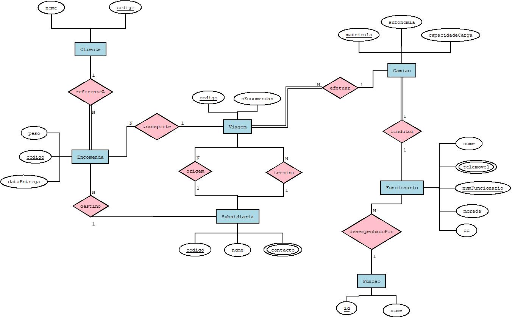

# C2 : Esquema conceptual

## Modelo E/A

ENTIDADES

* CLIENTE (codigo, nome)
* ENCOMENDA (codigo)
* SUBSIDIARIA (codigo, nome, contacto)
* VIAGEM (codigo)
* CAMIAO (matricula_, autonomia, capacidadeCarga)
* FUNCIONARIO (numFuncionario, nome, telemovel, morada, cc)
* FUNCAO (armazem, condutor)

ASSOCIAÇÔES

* referenteA (CLIENTE, ENCOMENDA) 1:N P/T
* destino (ENCOMENDA, SUBSIDIARIA, VIAGEM) N:1
* limiteCarga (ENCOMENDA, VIAGEM, CAMIAO) N:1 T/P
* condutor (CAMIAO, FUNCIONARIO) 1:1 
* desempenhadoPor (FUNCIONARIO, FUNCAO) N:1 
* origem (SUBSIDIARIA, VIAGEM) N:1

 
 

## Regras de negócio adicionais (Restrições)

Para ser selecionado para condutor da nossa empresa tem de ter a carta de condução de pesados.
Pode existir troca de turnos entre funcionários do mesmo grupo, nunca um funcionário de armazém pode trocar de turno com um condutor.

---
[< Previous](rebd01.md) | [^ Main](https://github.com/SIBD08/SIBD08-Atlas/) | [Next >](rebd03.md)
:--- | :---: | ---: 
